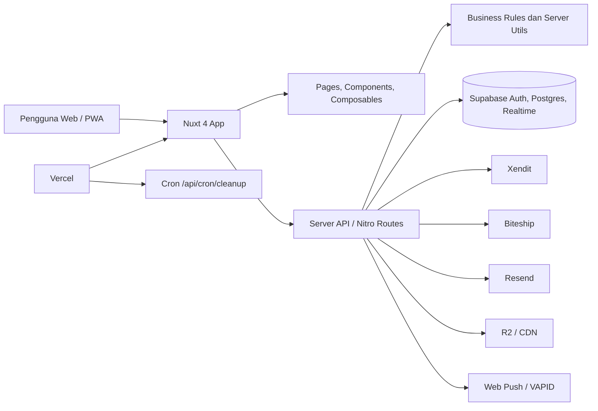

<!-- markdownlint-disable MD033 MD041 -->
<div align="center">

# VivaThrift


**Dari Mahasiswa ITS, Untuk Mahasiswa ITS.**\
Marketplace preloved eksklusif untuk civitas akademika Institut Teknologi Sepuluh Nopember.

🛍️ Preloved Berkualitas · ♻️ Ekonomi Sirkular · 🔐 Khusus Mahasiswa ITS · 💸 Harga Mahasiswa

</div>
<!-- markdownlint-enable MD033 MD041 -->

---

## Mengapa VivaThrift Ada?

Setiap pergantian semester, siklus ini selalu berulang: **maba** sibuk berburu buku SKPB dan alat praktikum yang lumayan menguras kantong, sementara **mahasiswa tingkat akhir** kebingungan *decluttering* barang di kosan sebelum lulus.

Daripada dibuang atau berdebu di lemari, kenapa tidak diwariskan ke sesama yang membutuhkan? **VivaThrift** hadir untuk menjembatani hal tersebut — membangun ekosistem ekonomi sirkular lokal kampus yang **eksklusif, aman, dan ramah di kantong mahasiswa.**

---

## Keunggulan Platform

### 🛡️ 100% Eksklusif Anak ITS

Bebas dari penipuan pihak luar. Akses VivaThrift dikunci ketat — hanya email institusi aktif berformat `NRP@student.its.ac.id` yang bisa mendaftar. Identitas setiap penjual dan pembeli terjamin valid.

### 🤝 COD Kampus atau Kirim Kurir

Mager keluar kosan di Keputih atau Gebang? Pilih kirim kurir. Mau sekalian nongkrong nunggu kelas? COD di Kantin Pusat, Perpus, atau selasar departemen. Super fleksibel.

### 🌱 Dompet Aman, Bumi Nyaman

Barang preloved berkualitas dengan harga miring, lengkap fitur nego. Hemat di kantong sekaligus ikut andil mengurangi limbah barang di lingkungan kampus.

---

## Fitur Utama

| Fitur | Deskripsi |
| --- | --- |
| **Katalog Produk** | Jelajahi barang preloved berdasarkan kategori, kondisi, harga, dan ketersediaan COD/nego |
| **Filter & Sorting** | Filter multi-kriteria (kategori, kondisi, nego, COD) dengan sorting terbaru/termurah/termahal |
| **Pencarian** | Cari barang langsung dari navbar — hasil instan |
| **Profil Penjual** | Lihat reputasi, rating, fakultas, dan produk aktif setiap penjual |
| **Upload Produk** | Pasang barang dengan multi-foto, cropper gambar, kategori, kondisi, deskripsi, dan preferensi pengiriman |
| **Chat & Penawaran** | Chat real-time antar pembeli dan penjual langsung dari halaman produk |
| **Dark Mode** | Tampilan gelap yang nyaman di mata, dengan toggle di navbar |
| **Online Presence** | Indikator real-time siapa yang sedang online |
| **Responsif** | Tampilan optimal di desktop, tablet, dan mobile |

---

## Tech Stack

| Layer | Teknologi |
| --- | --- |
| **Framework** | Nuxt 4 (Vue 3 + Composition API) |
| **Styling** | Tailwind CSS + custom design tokens |
| **Backend & Auth** | Supabase (PostgreSQL, Auth, Storage, Realtime) |
| **Font** | Inter (body), Plus Jakarta Sans (heading), Himpun (branding) |
| **Bahasa** | TypeScript |

---

## Setup Lokal

### Prasyarat

- Node.js 22+
- pnpm 10+
- Proyek Supabase yang aktif

### Instalasi

```bash
pnpm install
```

### Konfigurasi Environment

Salin file contoh environment lalu isi nilainya sesuai project-mu:

```bash
copy .env.example .env
```

Minimal variabel yang perlu diisi untuk development dasar:

- `SUPABASE_URL`
- `SUPABASE_KEY`
- `SUPABASE_SECRET_KEY`
- `R2_ACCOUNT_ID`
- `R2_ACCESS_KEY_ID`
- `R2_SECRET_ACCESS_KEY`
- `R2_BUCKET_NAME`
- `R2_ENDPOINT`
- `R2_PUBLIC_URL`

Jika fitur terkait aktif, isi juga:

- `VAPID_PUBLIC_KEY`
- `VAPID_PRIVATE_KEY`
- `VAPID_SUBJECT`
- `RESEND_API_KEY`
- `SENTRY_DSN`
- `SENTRY_AUTH_TOKEN`
- `SITE_URL`
- `XENDIT_KEY` atau `XENDIT_SECRET_KEY`
- `XENDIT_CALLBACK_TOKEN` atau `XENDIT_WEBHOOK_TOKEN`
- `XENDIT_PAYMENT_FEE_PERCENT` (opsional, default `0`)
- `XENDIT_PAYMENT_FEE_FLAT` (opsional, default `0`)
- `XENDIT_PAYMENT_FEE_BY_CHANNEL_JSON` (opsional, default `{}`)
- `XENDIT_PAYMENT_FEE_TAX_PERCENT` (opsional, default `11`)
- `XENDIT_DISBURSEMENT_FEE_SELLER_FLAT` (opsional, default `2500`)
- `XENDIT_DISBURSEMENT_FEE_ADMIN_FLAT` (opsional, default `2500`)
- `XENDIT_AUTO_DISBURSE_ADMIN_FEE` (opsional, default `false`)
- `BITESHIP_KEY`
- `UPSTASH_REDIS_REST_URL`
- `UPSTASH_REDIS_REST_TOKEN`

### Menjalankan Project

```bash
pnpm dev
```

Secara default aplikasi berjalan di `http://localhost:3004`.

### Validasi Dasar

```bash
pnpm typecheck
pnpm test
```

### Catatan

- Modul Nuxt Supabase sekarang memakai `SUPABASE_SECRET_KEY`; jangan lagi memakai `SUPABASE_SERVICE_KEY` untuk setup baru.
- Aset email publik seperti logo harus mengarah ke domain produksi agar tampil di email client.

---

## Gambaran Arsitektur

VivaThrift dibangun sebagai Nuxt 4 full-stack app dengan UI, server routes, dan business rules dalam satu repo. Frontend berada di `app/`, API server berada di `server/api/`, dan migration database dikelola di `supabase/migrations/`.



### Lapisan Utama

| Layer | Tanggung Jawab | Lokasi Utama |
| --- | --- | --- |
| Frontend | Halaman, layout, komponen, composables, PWA UX | `app/` |
| Backend app | Nitro server routes untuk checkout, orders, shipping, upload, webhook, push | `server/api/` |
| Domain logic | Rule bisnis offer, order, COD, platform fee, state machine | `server/utils/` |
| Data | Auth, Postgres, storage metadata, realtime | Supabase |
| Integrasi eksternal | Payment, shipping, email, object storage, monitoring | Xendit, Biteship, Resend, R2, Sentry |
| Deploy | Hosting app, server routes, scheduled cleanup | Vercel |

### Alur Bisnis Inti

1. User browse atau upload produk dari Nuxt app.
2. Server route memvalidasi request memakai domain rules di server.
3. Data transaksi, offer, chat, dan profil disimpan di Supabase.
4. Checkout dan webhook pembayaran diproses lewat Xendit.
5. Pengiriman didukung lewat COD kampus atau integrasi shipping.
6. Email notifikasi dikirim via Resend dan push notification via Web Push.

---

## Gambaran API

Route server utama dikelompokkan per domain agar vertical slice tetap jelas.

| Grup Endpoint | Fungsi |
| --- | --- |
| `server/api/cart/` | Operasi keranjang belanja |
| `server/api/checkout/` | Checkout, payment initiation, settlement flow |
| `server/api/offers/` | Penawaran harga antara buyer dan seller |
| `server/api/orders/` | Status pesanan, COD, shipping, completion |
| `server/api/disputes/` | Sengketa transaksi dan mediasi |
| `server/api/reviews/` | Rating dan ulasan setelah transaksi |
| `server/api/shipping/` | Estimasi, opsi pengiriman, helper shipping |
| `server/api/upload/` | Upload media dan asset handling |
| `server/api/push/` | Subscribe, unsubscribe, dan public VAPID key |
| `server/api/webhooks/` | Webhook dari provider eksternal seperti Xendit |
| `server/api/seller/` | Dashboard dan analytics seller |
| `server/api/admin/` | Operasi admin dan moderation |
| `server/api/cron/` | Scheduled cleanup dan background maintenance |

### Endpoint yang Paling Penting

| Method | Endpoint | Kegunaan |
| --- | --- | --- |
| `POST` | `/api/contact` | Kirim pesan ke tim VivaThrift + auto-reply email |
| `POST` | `/api/push/subscribe` | Simpan push subscription browser user |
| `POST` | `/api/push/unsubscribe` | Hapus push subscription browser user |
| `GET` | `/api/push/vapid-public-key` | Ambil public key untuk Web Push |
| `GET` | `/api/__sitemap__/urls` | Sumber URL dinamis untuk sitemap |
| `GET` | `/api/cron/cleanup` | Endpoint maintenance yang dipanggil oleh Vercel Cron |

### Rule Domain Penting

Beberapa aturan bisnis inti disimpan terpusat agar tidak tersebar di handler:

- `server/utils/domain-rules.ts`: status produk, rule offer, SLA order, lokasi COD, OTP meetup, platform fee.
- `server/utils/state-machine.ts`: validasi transisi state untuk order, offer, dan product.
- `server/utils/supabase-admin.ts`: akses server-side ke Supabase memakai `SUPABASE_SECRET_KEY`.

---

## Deployment Guide

Deployment utama VivaThrift ditujukan ke Vercel dengan Nuxt Nitro.

### Prasyarat Deployment

- Project Vercel terhubung ke repository ini
- Seluruh environment variable production sudah diisi di dashboard Vercel
- Project Supabase production aktif
- Domain publik dan asset host untuk media sudah siap

### Environment Minimum di Production

- `SUPABASE_URL`
- `SUPABASE_KEY`
- `SUPABASE_SECRET_KEY`
- `R2_ACCOUNT_ID`
- `R2_ACCESS_KEY_ID`
- `R2_SECRET_ACCESS_KEY`
- `R2_BUCKET_NAME`
- `R2_ENDPOINT`
- `R2_PUBLIC_URL`
- `SITE_URL`

Jika fitur aktif, tambahkan juga:

- `VAPID_PUBLIC_KEY`
- `VAPID_PRIVATE_KEY`
- `VAPID_SUBJECT`
- `RESEND_API_KEY`
- `XENDIT_KEY` atau `XENDIT_SECRET_KEY`
- `XENDIT_CALLBACK_TOKEN` atau `XENDIT_WEBHOOK_TOKEN`
- `XENDIT_PAYMENT_FEE_PERCENT` (opsional, default `0`)
- `XENDIT_PAYMENT_FEE_FLAT` (opsional, default `0`)
- `XENDIT_PAYMENT_FEE_BY_CHANNEL_JSON` (opsional, default `{}`)
- `XENDIT_PAYMENT_FEE_TAX_PERCENT` (opsional, default `11`)
- `XENDIT_DISBURSEMENT_FEE_SELLER_FLAT` (opsional, default `2500`)
- `XENDIT_DISBURSEMENT_FEE_ADMIN_FLAT` (opsional, default `2500`)
- `XENDIT_AUTO_DISBURSE_ADMIN_FEE` (opsional, default `false`)
- `BITESHIP_KEY`
- `BITESHIP_WEBHOOK_TOKEN` atau `BITESHIP_WEBHOOK_BASIC_*` jika auth webhook Biteship diaktifkan
- `UPSTASH_REDIS_REST_URL`
- `UPSTASH_REDIS_REST_TOKEN`
- `SENTRY_DSN`
- `SENTRY_ORG`
- `SENTRY_PROJECT`
- `SENTRY_AUTH_TOKEN`

### Langkah Deploy

1. Pastikan branch yang akan dirilis sudah lolos CI: `pnpm test`, `pnpm typecheck`, dan build.
2. Pastikan migration Supabase yang diperlukan sudah diaplikasikan.
3. Push perubahan ke `main` atau jalankan deploy dari dashboard Vercel.
4. Vercel akan menjalankan install dan build Nuxt secara otomatis.
5. Setelah deploy selesai, verifikasi halaman publik, auth, checkout, dan endpoint webhook penting.

### Scheduled Job

Repo ini sudah mendefinisikan Vercel Cron di `vercel.json`:

- `0 2 * * *` → memanggil `/api/cron/cleanup`

Pastikan endpoint cleanup aman dijalankan berulang dan environment production untuk job ini juga lengkap.

### Verifikasi Setelah Deploy

- Buka homepage dan halaman info seperti `/about`, `/faq`, `/terms`, dan `/privacy`
- Pastikan login dan session Supabase berjalan normal
- Uji minimal satu alur checkout non-produksi atau sandbox
- Pastikan email template dan asset publik termuat benar
- Pastikan push notification tidak error saat public key diminta
- Cek Sentry dan log Vercel untuk error runtime awal

### Rollback Singkat

Jika deploy baru bermasalah:

1. Promote deployment Vercel sebelumnya yang masih sehat
2. Revert commit yang bermasalah di repository
3. Jika masalah berasal dari migration, lakukan rollback database dengan prosedur yang aman sebelum redeploy

---

## Dokumentasi Tambahan

- Lihat `CONTRIBUTING.md` untuk workflow kontribusi, branch naming, commit format, dan PR checklist.
- Lihat `SECURITY.md` untuk responsible disclosure dan alur pelaporan kerentanan.
- Lihat `docs/qa/README.md` untuk index QA bundle (chat realtime, checkout/Xendit, template report, dan checklist uji).
- Lihat `docs/runbooks/deploy-vercel.md` untuk prosedur deploy, verifikasi pasca-deploy, dan rollback production.
- Lihat `docs/runbooks/supabase-migrations.md` untuk prosedur migration database, sinkronisasi type, dan rollback schema Supabase.
- Lihat `docs/api/openapi-public.yaml` untuk fondasi OpenAPI 3.1 endpoint `contact` dan `push`.

---

## Tim Pengembang

Kolaborasi lima mahasiswa lintas departemen dari FTEIC dan FSAD ITS — Project Mata Kuliah Kewirausahaan Berbasis Teknologi 28, Kelompok 1.

| Nama | NRP | Departemen | Fakultas |
| --- | --- | --- | --- |
| Muhammad Ichlas Rifqi F. | 5023221003 | Teknik Biomedik | FTEIC |
| Tiara Aryacitra Dhaneswari | 5023221053 | Teknik Biomedik | FTEIC |
| Muhammad Iqbal Baiduri Yamani | 5026221103 | Sistem Informasi | FTEIC |
| Ravarel Harsha Athalla | 5026221048 | Sistem Informasi | FTEIC |
| Fathimah Humairoh | 5002221147 | Matematika | FSAD |

---

<!-- markdownlint-disable MD033 -->
<div align="center">

✍️ Tim VivaThrift — ITS 2026

</div>
<!-- markdownlint-enable MD033 -->
